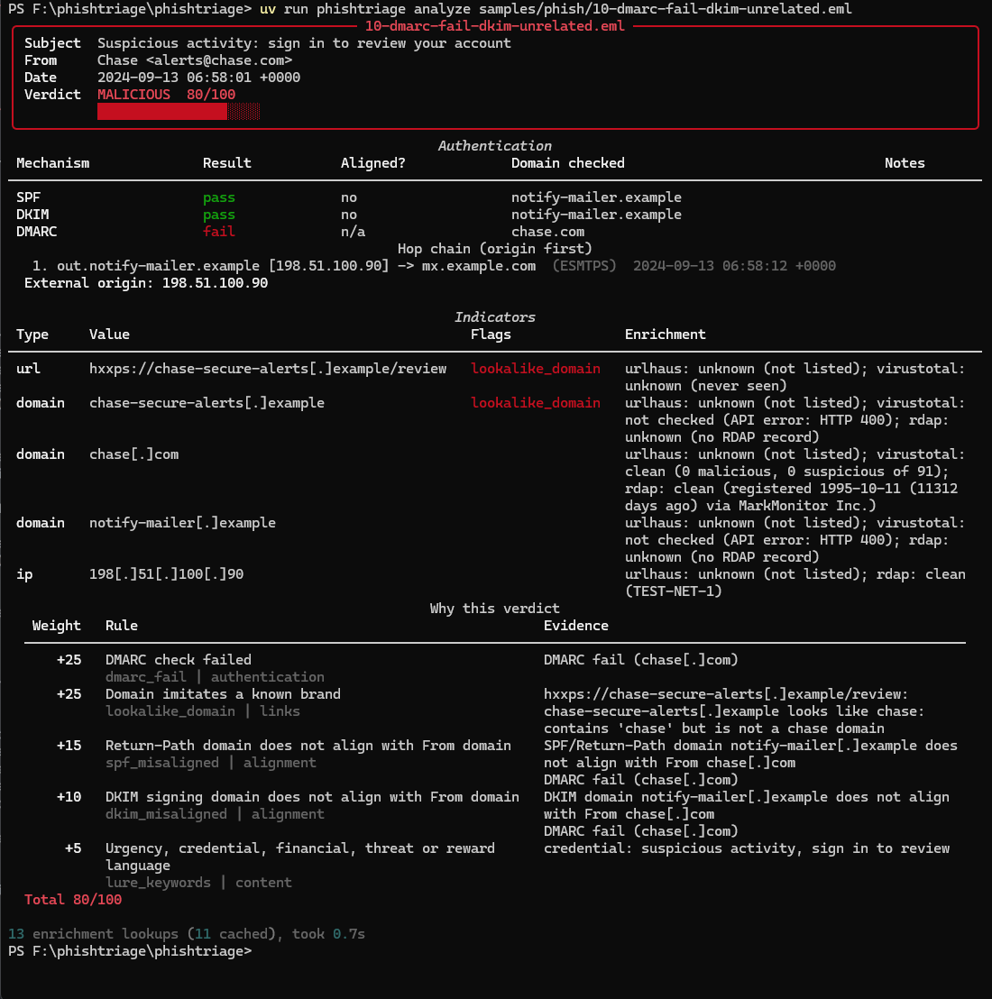

# phishtriage

[](https://github.com/AidenKnecht/PhishTriage/actions/workflows/ci.yml)

A command-line phishing email analyzer that does what a SOC analyst does on first
contact with a suspicious `.eml`: parse the headers, check SPF/DKIM/DMARC and
whether the authenticated domain actually matches the displayed one, walk the
`Received:` chain back to the origin, pull out every URL and attachment, look the
indicators up against free threat-intel APIs, and print a scored verdict with
the evidence behind every point. Every rule is a line in a YAML file you can
read and argue with. I built it after a year of doing this by hand on a
corporate IT security team.



## Quickstart

```
uv sync
cp .env.example .env          # optional: add a VirusTotal key
uv run phishtriage analyze samples/phish/01-lookalike-domain.eml
```

Add `--offline` to skip enrichment entirely; everything else still runs.
`--json out.json` and `--markdown out.md` write the same report in
ticket-friendly forms. `uv run phishtriage rules` prints every scoring rule.

## What it checks

| Category | Signals |
|---|---|
| Authentication | SPF, DKIM, DMARC results from `Authentication-Results`, `ARC-Authentication-Results` and `Received-SPF`; missing headers |
| Alignment | Return-Path vs From (relaxed), DKIM `d=` vs From, Reply-To on a different domain, display name that names a brand or embeds another address |
| Hop chain | `Received:` headers reversed to origin-first, boundary hop and external origin IP, private IPs presented as external, timestamps out of order or jumping >24h, reverse-DNS mismatch with `--live-dns` |
| Links | URL extraction from text and HTML, visible-text vs `href` mismatch, lookalike and typosquat domains against `rules/brands.txt`, URL shorteners, raw-IP URLs, punycode, credentials-in-URL, deep subdomains, file-hosting services |
| Attachments | SHA-256/MD5, declared vs magic-byte type, double extensions, executables, macro-enabled Office (by extension or by `vbaProject.bin` inside the ZIP), `.iso`/`.img`/`.lnk`/`.html`, password-protected archives |
| Content | Urgency, credential, financial, threat and reward lure phrases from `rules/keywords.txt` |
| Enrichment | URLhaus URL/host listings, VirusTotal URL/domain/hash detections, RDAP domain age and origin-IP country. Cached 24h on disk. |

Attachments are never opened or executed, and URLs are never fetched. All
enrichment is API-only and defaults to defanged output (`hxxps://evil[.]example`).

## How scoring works

Each signal maps to a rule in [`rules/scoring.yaml`](rules/scoring.yaml) with an
id, weight, category, condition, and a one-sentence rationale. The scorer sums
the weights of the rules that fire, caps at 100, and reports:

| Score | Verdict |
|---|---|
| 0-19 | CLEAN |
| 20-49 | SUSPICIOUS |
| 50-79 | LIKELY PHISH |
| 80-100 | MALICIOUS |

Rules are data. Adding a lure keyword, changing a weight, or moving a verdict
threshold is a text edit, and `uv run pytest` re-checks the sample corpus
against it. The design notes behind each weight are in
[`DECISIONS.md`](DECISIONS.md).

## Batch results

`uv run phishtriage batch samples/ --offline` on the synthetic corpus:

| File | Score | Verdict | Top rule |
|---|---:|---|---|
| benign/01-newsletter.eml | 5 | CLEAN | lure_keywords |
| benign/02-password-reset.eml | 10 | CLEAN | lure_keywords |
| benign/03-github-notification.eml | 0 | CLEAN | |
| benign/04-internal-no-auth.eml | 20 | SUSPICIOUS | no_auth_headers |
| benign/05-invoice-pdf.eml | 0 | CLEAN | |
| benign/06-shared-doc.eml | 0 | CLEAN | |
| phish/01-lookalike-domain.eml | 65 | LIKELY PHISH | lookalike_domain |
| phish/02-display-name-spoof.eml | 55 | LIKELY PHISH | display_name_spoof |
| phish/03-reply-to-hijack.eml | 90 | MALICIOUS | dmarc_fail |
| phish/04-link-text-mismatch.eml | 70 | LIKELY PHISH | lookalike_domain |
| phish/05-shortened-url.eml | 80 | MALICIOUS | dmarc_fail |
| phish/06-raw-ip-url.eml | 70 | LIKELY PHISH | display_name_spoof |
| phish/07-double-extension.eml | 70 | LIKELY PHISH | double_extension |
| phish/08-macro-doc.eml | 75 | LIKELY PHISH | dmarc_fail |
| phish/09-invoice-urgency.eml | 55 | LIKELY PHISH | display_name_spoof |
| phish/10-dmarc-fail-dkim-unrelated.eml | 80 | MALICIOUS | dmarc_fail |
| phish/11-punycode-domain.eml | 70 | LIKELY PHISH | display_name_spoof |
| phish/12-html-attachment.eml | 50 | LIKELY PHISH | container_attachment |

Synthetic corpus: 12/12 phish, 6/6 benign, 0 missed, 0 false alarms.

Then 15 real emails from my own Gmail and university Microsoft 365 inboxes
(sanitised: my details replaced, tracking tokens redacted, and the compromised
classmates' accounts pseudonymised; see [`samples/README.md`](samples/README.md)):

| File | Score | Verdict | Top rule |
|---|---:|---|---|
| benign/real-01-udemy-promo.eml | 0 | CLEAN | |
| benign/real-02-golfnow-promo.eml | 0 | CLEAN | |
| benign/real-03-isc2-webinar.eml | 25 | SUSPICIOUS | link_text_mismatch |
| benign/real-04-labcorp-notice.eml | 0 | CLEAN | |
| benign/real-05-website-listing-claimed.eml | 0 | CLEAN | |
| benign/real-06-bootcamp-promo.eml | 0 | CLEAN | |
| benign/real-07-intrastack-interview.eml | 0 | CLEAN | |
| benign/real-08-glowup-charity-form.eml | 5 | CLEAN | lure_keywords |
| benign/real-09-globifye-assessment.eml | 15 | CLEAN | lure_keywords |
| phish/real-01-mychart-medicare-kit.eml | 65 | LIKELY PHISH | display_name_spoof |
| phish/real-02-uc-account-job-scam-admin.eml | 35 | SUSPICIOUS | dkim_fail_or_none |
| phish/real-03-uc-account-job-scam-assistant.eml | 25 | SUSPICIOUS | dkim_fail_or_none |
| phish/real-04-uc-account-credential-update.eml | 40 | SUSPICIOUS | lure_keywords |
| phish/real-05-uc-account-credential-update-2.eml | 35 | SUSPICIOUS | dkim_fail_or_none |
| phish/real-06-insureio-fake-teams-interview.eml | 5 | CLEAN | lure_keywords |

Whole corpus at threshold 50: 28/33 correct, 5 missed, 0 false alarms. Four
of the misses are the same thing: job scams and credential lures sent from
compromised student accounts *inside* the university's own Microsoft 365
tenant. No `Authentication-Results`, no external hop, a sender domain that is
genuinely the university's. Every infrastructure check passes because the
infrastructure is clean; only the text is wrong, and text is deliberately
capped at 15 points. They are listed in `samples/known-misses.txt` and the
regression test holds them at SUSPICIOUS. The fifth miss is worse: a
fake-interview scam ("install Microsoft Teams to meet a recruiter") that
scores CLEAN because nothing about it is structurally wrong. The one benign
SUSPICIOUS is an ISC2
webinar invite whose visible link text says `isc2.org` while every href goes
through Salesforce's click-tracker, which is a real mismatch that every
marketing platform produces.

Real-mail calibration also fixed three bugs the synthetic set couldn't show:
Microsoft 365 and Gmail hop chains never name the recipient's domain, so
boundary detection now works in provider families; DKIM signed by a tenant's
`onmicrosoft.com` domain is normal, so alignment rules only score when DMARC
itself failed; and `storage.googleapis.com` is Google, not a Google lookalike.

## Limitations

- **No sandboxing.** Attachments are hashed and type-sniffed, never detonated. A
  novel dropper with a clean hash and a plausible extension scores on its
  wrapper, not its behavior.
- **Heuristic scoring.** Weights are hand-tuned on a small corpus. A well-crafted
  phish from a freshly registered, fully authenticated domain with a plain
  "please review" body can score CLEAN offline; enrichment (domain age, URL
  reputation) is what catches that class.
- **Free-tier API limits.** VirusTotal allows 4 lookups a minute; the tool
  rate-limits itself and caps lookups per email, so link-heavy mail is only
  partially enriched. URLhaus may require a free auth key.
- **No machine learning**, by design. Every point on the score traces to a
  rule with a written rationale.
- **Organisational-domain matching is approximate.** A short built-in suffix list
  stands in for the Public Suffix List, so alignment on unusual TLDs may be
  wrong in the cautious direction.

## What I'd build next

- Decode IDN hostnames and run the lookalike check on the Unicode form, so
  `xn--` domains are scored for the brand they imitate, not just for being IDN.
- A `--compare` mode that diffs two rule files against the corpus, to make
  weight tuning a reviewable change.
- QR-code extraction from image attachments (quishing), which is now a common
  way to keep the URL out of the body.
- An `.msg` (Outlook) reader, since that is what users actually forward.
- Optional MISP/OpenCTI export of the indicators table.
